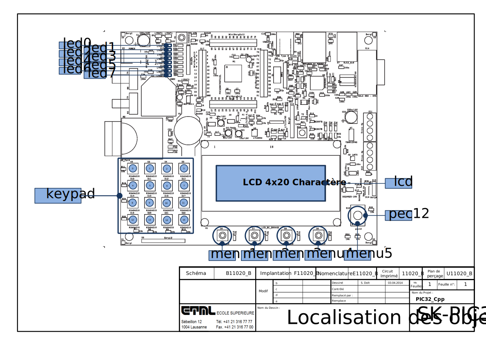

Utilisation avec le starter kit PIC32 de l'ETML-ES
**************************************************

Le fichier "ETML-ES/SK-PIC32-B.h" contient des instances globales
permettant d'accélerer le prototypage. Pour les utiliser, il faut tout 
d'abord importer les définitions  concernant la carte :

.. code-block:: cpp

    #include "ETML-ES/SK-PIC32-B.h"
  

Emplacement
============

La figure suivante montre la relation entre les noms des instances et
les éléments hardware qui s'y rapporte.

Ainsi, on peut écrir sur le LCD avec le code suivant:

.. code-block:: cpp

    lcd << "Bonjour";
    
Et ceci, sans avoir à initialiser une instance de la classe TextDisplay.

Définitions
============

Les objets définits sont les suivants:

.. cpp:member:: TextDisplay lcd
   
   Affichage LCD 4x20 charactères
   

   
.. cpp:member:: Key menu1
   
   Bouton "SEscMenu"

.. cpp:member:: Key menu2
   
   Bouton "S+"

.. cpp:member:: Key menu3
   
   Bouton "S-"

.. cpp:member:: Key menu4

   Bouton "S_Ok"

.. cpp:member:: Key menu5
   
   Bouton du PEC12 (PEC12_PB)
  
.. cpp:member:: IncrementalEncoder pec12

   Gestion des rotations du PEC12
   
.. cpp:member:: Led led0

   Led D6
   
.. cpp:member:: Led led1

   Led D10
   
.. cpp:member:: Led led2

   Led D7
   
.. cpp:member:: Led led3

   Led D11
   
.. cpp:member:: Led led4

   Led D8
   
.. cpp:member:: Led led5

   Led D12

.. cpp:member:: Led led6

   Led D9
   
.. cpp:member:: Led led7

   Led D13
   
.. cpp:member:: Keypad keypad

   Clavier matriciel, touche S10 à S22

