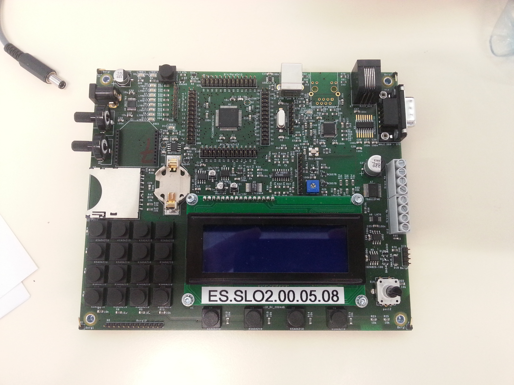

Documentation de la librairie PIC32_Cpp
***************************************

Table des matières:
--------------------

.. toctree::
   :maxdepth: 2
   
   install
   tutoriel
   boards/ETML-ES-SK-PIC32-B
   boards/ETML-ES-SK-PIC32-B-TUTO
   core/delay
   hw/DigitalPin
   
   
Présentation
============

Cette librairie contient des drivers objets en C++ pour piloter de 
manière aisée le starter-kit "PIC32" de l'Ecole Supérieur de l'ETML 
à Lausanne.

Listes et tables
=================

* :ref:`genindex`
* :ref:`modindex`
* :ref:`search`

