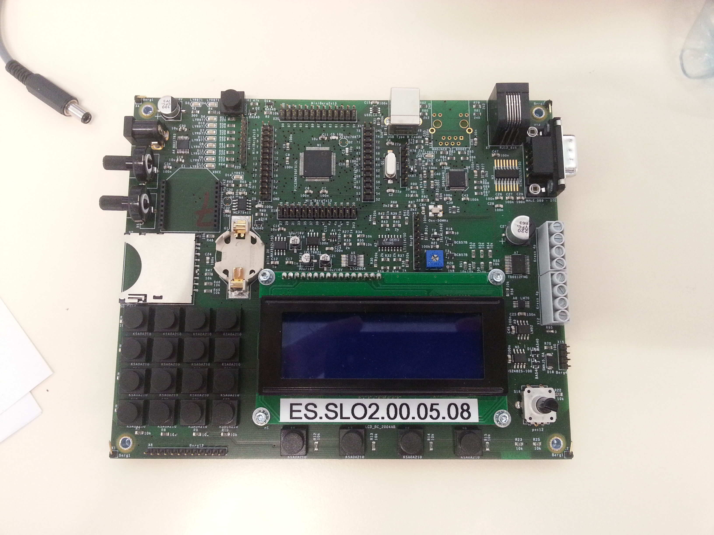

Introduction
*************

Présentation
============

Cette librairie contient des drivers objets en C++ pour piloter de 
manière aisée le starter-kit "PIC32" de l'Ecole Supérieur de l'ETML 
à Lausanne.

